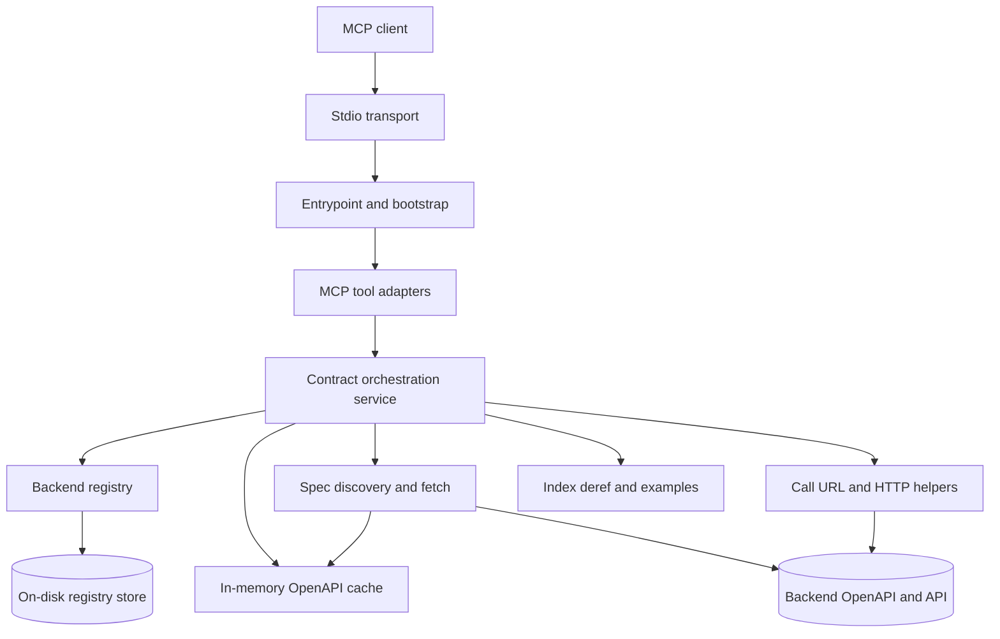
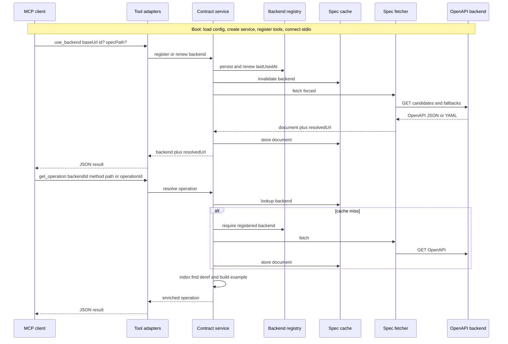
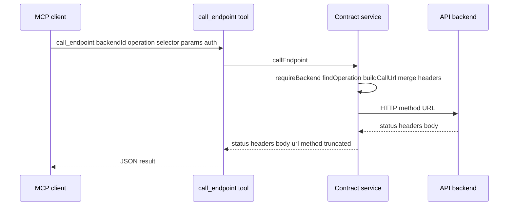

# Architecture

This document describes the communication flow between an MCP client and OpenAPI-capable backends when using `openapi-contract`.

## Overview

`openapi-contract` is a **native MCP server** built with [`@modelcontextprotocol/sdk`](https://www.npmjs.com/package/@modelcontextprotocol/sdk). There is no child process or NDJSON proxy; the MCP protocol is handled directly over stdio.

By default the server is **read-only**: it fetches, caches, and queries OpenAPI documents so agents can build against the real API shape. Optional HTTP execution (`call_endpoint`) is registered only when `OPENAPI_MCP_ENABLE_CALLS` is truthy (`1` / `true` / `yes`).

| Responsibility                        | Where                                                                                                                                                      |
| ------------------------------------- | ---------------------------------------------------------------------------------------------------------------------------------------------------------- |
| Env → TTLs / registry / call limits   | [`src/config.ts`](src/config.ts)                                                                                                                           |
| Boot + tool registration + stdio      | [`src/index.ts`](src/index.ts)                                                                                                                             |
| Thin MCP tool adapters (Zod)          | [`src/tools/*`](src/tools)                                                                                                                                 |
| Orchestration façade                  | [`src/service.ts`](src/service.ts)                                                                                                                         |
| Disk backend registry (metadata only) | [`src/registry.ts`](src/registry.ts)                                                                                                                       |
| In-memory OpenAPI cache               | [`src/openapi/cache.ts`](src/openapi/cache.ts)                                                                                                             |
| Spec fetch / discovery / parse        | [`src/openapi/fetch.ts`](src/openapi/fetch.ts)                                                                                                             |
| Call URL + HTTP response helpers      | [`src/openapi/call-url.ts`](src/openapi/call-url.ts), [`src/openapi/call.ts`](src/openapi/call.ts)                                                         |
| Index, deref, request examples        | [`src/openapi/index-ops.ts`](src/openapi/index-ops.ts), [`src/openapi/deref.ts`](src/openapi/deref.ts), [`src/openapi/example.ts`](src/openapi/example.ts) |

---

## Component layout

---

## Communication flow

Typical agent path: register a backend, then inspect a single operation (with cache hit/miss).

When `OPENAPI_MCP_ENABLE_CALLS` is enabled, agents may also execute an operation:

---

## Key design decisions

### 1. Native MCP server

The server uses `@modelcontextprotocol/sdk`'s `McpServer` with `StdioServerTransport`. There is no child process or NDJSON proxy. Errors go to stderr; stdout is reserved for MCP framing.

### 2. Read-only by default; optional execute

Contract tools always fetch, parse, index, dereference, and summarize OpenAPI documents. `call_endpoint` is **not registered** unless `OPENAPI_MCP_ENABLE_CALLS` is truthy. Secrets are never stored in the registry: callers pass `headers` and/or `headerEnv` per call. Request bodies are not validated against OpenAPI schemas (the backend validates).

### 3. On-demand backends

There is no env list of backends. Agents call `use_backend` with a `baseUrl` (and optional `id` / `specPath`). The registry persists metadata on disk and renews `lastUsedAt` on each successful use.

### 4. Dual TTL (+ call limits)

- **Spec cache** (in-memory, default 60s via `OPENAPI_MCP_CACHE_TTL_MS`): holds the OpenAPI document; invalidated on `use` / `refresh` / `forget`.
- **Backend registry** (on disk, default 1 day via `OPENAPI_MCP_REGISTRY_TTL_MS`): stores `{ id, baseUrl, specPath?, lastUsedAt }` only; expired entries are pruned on load.
- **Call timeout / body cap** (`OPENAPI_MCP_CALL_TIMEOUT_MS`, `OPENAPI_MCP_CALL_MAX_BODY_BYTES`): apply only to `call_endpoint`.

OpenAPI documents are never written to the registry file.

### 5. Thin tools, fat service

Tool modules under `src/tools/` validate inputs with Zod and wrap results as JSON text / `isError`. `OpenApiContractService` owns orchestration across registry, cache, fetch, index, deref, examples, and optional HTTP calls. Spec discovery (`fetch.ts`) stays separate from operation execution (`call.ts` / `call-url.ts`).

### 6. Spec discovery

Default path is `/docs-json` (Nest Swagger). Ordered fallbacks: `/docs-yaml` → `/openapi.json` → `/v3/api-docs`. Absolute document URLs are accepted and split into origin + `specPath`.

### 7. Call URL assembly

`call_endpoint` builds URLs as `baseUrl` + optional relative (or same-origin) `servers[0]` prefix + operation path (with path params and query). Absolute `servers` entries on a different origin are ignored so calls stay on the registered backend.

### 8. Local `$ref` dereference only

`deref` resolves local `#/` references. Cycles are annotated with `x-circular-ref`; external refs become `x-unresolved-ref` and are not fetched.

### 9. Agent-friendly errors

If a tool needs a backend that is missing or expired, the service returns a clear message telling the agent to call `use_backend` first (and similarly for missing operations). For `call_endpoint`, HTTP 4xx/5xx are successful MCP payloads with `status`; `isError` is reserved for transport/local failures (timeout, missing path param, missing `headerEnv`, etc.).

### 10. Injectable seams for tests

`fetch` and clock/`now` dependencies can be injected so unit tests exercise registry TTL, cache behavior, fetch discovery, and call_endpoint without a live network.
